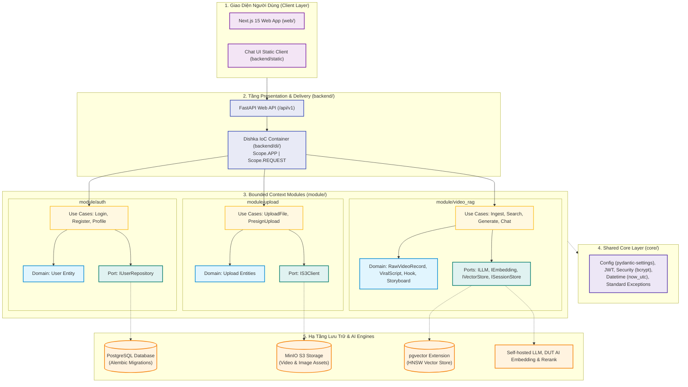

# RAG Viral Video — Nền Tảng Tự Động Hóa Kịch Bản Video Viral Cho Sáng Tạo Nội Dung

> **Hệ thống AI Agent tự động phân tích pattern từ kho video triệu view (MinIO) và sinh kịch bản video ngắn (TikTok / Shorts / Reels) chuẩn hóa từng giây: Hook 3s giữ chân người xem, Storyboard trực quan và Prompts cho AI tạo ảnh/video.**

🏛️ **Kiến trúc:** Thiết kế theo chuẩn **Modular Clean Architecture & Domain-Driven Design (DDD)** kết hợp **Dishka IoC Container** — Phân tách tuyệt đối giữa **Cross-cutting Core** (`core/`), **Domain Modules** (`module/auth`, `module/upload`, `module/video_rag`), **Presentation API** (`backend/`), và **Web Client** (`web/`).

---

## 📌 1. Bối Cảnh & Mục Tiêu

Hiện nay, việc sáng tạo video ngắn (Shorts, Reels, TikTok) phụ thuộc lớn vào **tỷ lệ giữ chân người xem trong 3-5 giây đầu (Retention Hook)** và nhịp điệu kịch bản. Các LLM thông thường thường viết kịch bản chung chung, không có "chất viral".

**RAG Viral Video** giải quyết vấn đề này bằng cách:
1. **Kết nối kho dữ liệu video viral sẵn có:** Nạp các video đã thành công (kèm transcript, caption, hashtag, tóm tắt và link video gốc tại MinIO).
2. **Vector hóa & Truy xuất Pattern tương đồng (RAG):** Tìm kiếm các công thức hook, nhịp điệu và câu chuyện phù hợp với chủ đề người dùng yêu cầu.
3. **Sinh kịch bản hoàn chỉnh (1-Click):**
   * **Hook chiến lược (3-5s):** Phân tích tâm lý giữ chân (retention rationale).
   * **Storyboard chi tiết từng giây:** Lời thoại voiceover, mô tả visual B-roll và hiệu ứng âm thanh SFX.
   * **AI Prompts:** Sẵn sàng sao chép sang Midjourney / Flux (tạo ảnh) hoặc Veo 3.1 / Runway Gen-3 / Kling (tạo video).
4. **Hội thoại tương tác (Conversational RAG):** Trò chuyện tinh chỉnh kịch bản theo ngữ cảnh lịch sử.

---

## 🏛️ 2. Sơ Đồ Kiến Trúc Hệ Thống (Modular Clean Architecture)



---

## 📚 3. Tài Liệu Thiết Kế Kỹ Thuật

Tài liệu chi tiết được tổ chức trong thư mục `docs/`:

| Tài Liệu | Mô Tả Chi Tiết |
|---|---|
| [System Architecture](docs/system-architecture.md) | Kiến trúc hệ thống, quy tắc phân tầng, sơ đồ Sequence nạp dữ liệu, sinh kịch bản & xác thực. |
| [Clean Architecture Guidelines](docs/clean-architecture.md) | Quy chuẩn phân tách Core vs Infra, Dependency Injection với Dishka, tiêu chuẩn Unit/Integration test. |
| [Product Requirements (PRD)](docs/project-overview-prd.md) | Yêu cầu sản phẩm, hành trình người dùng, dữ liệu kho JSON, chức năng và phi chức năng. |
| [Python Coding Standards](docs/python-coding-standards.md) | Quy chuẩn lập trình Python, đặt tên, type hints, docstrings và công cụ kiểm thử ruff/mypy. |
| [Backend Guide](backend/README.md) | Hướng dẫn phát triển, cấu hình Dishka, chạy API và testing tầng Presentation. |

---

## 🚀 4. Cấu Trúc Dữ Liệu Kho Video (Data Contract)

Hệ thống nạp trực tiếp file JSON từ kho dữ liệu với cấu trúc chuẩn thống nhất:

```json
[
  {
    "caption": "Bí quyết tạo thói quen kỷ luật trong 21 ngày với quy tắc 2 phút",
    "hashtag": "#phattrienvanthan #kỷluat #viral #thoi_quen",
    "transcript": "90% mọi người thất bại khi xây dựng thói quen mới vì họ mắc lỗi này...",
    "image_url": "https://minio.example.com/thumbnails/video_01.jpg",
    "summary": "Video phân tích lý do bỏ cuộc sớm và giải pháp 2 phút xây dựng thói quen.",
    "video_url": "https://minio.example.com/videos/video_01.mp4"
  }
]
```

| Trường (Key) | Kiểu Dữ Liệu | Mô Tả Chi Tiết |
|---|---|---|
| `caption` | `string` | Tiêu đề hoặc mô tả bài đăng của video |
| `hashtag` | `string` / `list[string]` | Thẻ hashtag phân loại chủ đề và xu hướng |
| `transcript` | `string` | Toàn bộ lời thoại video (dùng để vector hóa & học nhịp kịch bản) |
| `image_url` | `string` | URL ảnh thumbnail hoặc keyframe của video |
| `summary` | `string` | Tóm tắt ý chính của video (ngữ cảnh vector search) |
| `video_url` | `string` | Đường dẫn file video gốc lưu trữ tại MinIO Storage |

---

## 🛠️ 5. Hướng Dẫn Cài Đặt & Khởi Chạy

### 1. Khởi động PostgreSQL & MinIO (Docker)
```bash
docker compose up -d
```

### 2. Cài đặt Dependencies & Môi Trường Ảo
```bash
# Sử dụng uv:
uv sync

# Hoặc pip:
pip install -e .
```

### 3. Đồng bộ Database Migrations (Alembic)
```bash
alembic upgrade head
```

### 4. Khởi chạy Backend API
```bash
uvicorn backend.main:app --reload --port 8000
# hoặc: python main.py
```
* **Swagger UI:** `http://localhost:8000/docs`
* **Chat Client UI:** `http://localhost:8000/app`

### 5. Khởi chạy Frontend Web App (Next.js 15)
```bash
cd web
pnpm install
pnpm dev
```
Giao diện frontend sẽ chạy tại: `http://localhost:3000`

### 6. Chạy Kiểm Thử Tự Động (Tests)
```bash
pytest
```
Chạy toàn bộ 32+ bài test tự động bao gồm Unit Tests (Domain, Ports, Use Cases) và Integration Tests (Auth, Upload, Dishka).
