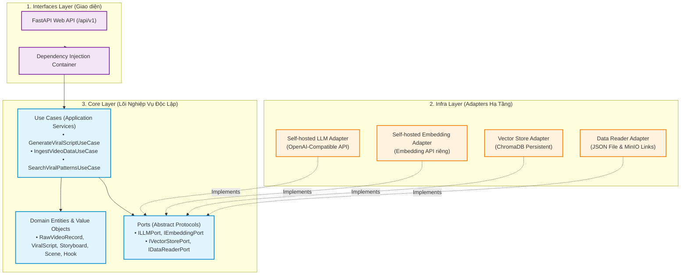

# RAG Viral Video — Nền Tảng Tự Động Hóa Kịch Bản Video Viral Cho Sáng Tạo Nội Dung

> **Hệ thống AI Agent tự động phân tích pattern từ kho video triệu view (MinIO) và sinh kịch bản video ngắn (TikTok / Shorts / Reels) chuẩn hóa từng giây: Hook 3s giữ chân người xem, Storyboard trực quan và Prompts cho AI tạo ảnh/video.**

🏛️ **Kiến trúc:** Thiết kế nghiêm ngặt theo chuẩn **Clean Architecture (Ports & Adapters / Hexagonal)** — Phân tách tuyệt đối giữa **Core Code** (Domain Entities, Use Cases, Ports) và **Infra Code** (Self-hosted LLM, Self-hosted Embedding, ChromaDB, MinIO).

---

## 📌 1. Bối Cảnh & Mục Tiêu

Hiện nay, việc sáng tạo video ngắn (Shorts, Reels, TikTok) phụ thuộc lớn vào **tỷ lệ giữ chân người xem trong 3-5 giây đầu (Retention Hook)** và nhịp điệu kịch bản. Các LLM thông thường thường viết kịch bản chung chung, không có "chất viral".

**RAG Viral Video** giải quyết vấn đề này bằng cách:
1. **Kết nối kho dữ liệu video viral sẵn có:** Nạp các video đã thành công (kèm transcript, caption, hashtag, tóm tắt và link video gốc tại MinIO).
2. **Vector hóa & Truy xuất Pattern tương đồng (RAG):** Tìm kiếm các công thức hook, nhịp điệu và câu chuyện phù hợp với chủ đề người dùng yêu cầu.
3. **Sinh kịch bản hoàn chỉnh (1-Click):**
   * **Hook chiến lược (3-5s):** Phân tích tâm lý giữ chân (retention rationale).
   * **Storyboard chi tiết từng giây:** Lời thoại voiceover, mô tả visual B-roll và hiệu ứng âm thanh SFX.
   * **AI Prompts:** Sẵn sàng sao chép sang Midjourney / Flux (tạo ảnh) hoặc Veo 3.1 / Runway Gen-3 / Kling (tạo video).

---

## 🏛️ 2. Kiến Trúc Clean Architecture: Core Code vs Infra Code

Hệ thống tuân thủ nghiêm ngặt **Quy tắc Phụ thuộc (Dependency Rule)**:



---

## 📚 3. Tài Liệu Thiết Kế Kỹ Thuật

Toàn bộ tài liệu chi tiết được tổ chức trong thư mục `docs/`:

| Tài Liệu | Mô Tả Chi Tiết |
|---|---|
| [System Architecture](docs/system-architecture.md) | Kiến trúc hệ thống, quy tắc phân tầng, sơ đồ Sequence nạp dữ liệu & sinh kịch bản. |
| [Product Requirements (PRD)](docs/project-overview-prd.md) | Yêu cầu sản phẩm, hành trình người dùng, dữ liệu kho JSON, chức năng và phi chức năng. |
| [Clean Architecture Guidelines](docs/clean-architecture.md) | Quy chuẩn phân tách Core vs Infra, Dependency Injection, tiêu chuẩn Unit/Integration test. |

---

## 🚀 4. Cấu Trúc Dữ Liệu Kho Video (Data Contract)

Hệ thống nạp trực tiếp file JSON từ kho dữ liệu có cấu trúc tiếng Anh chuẩn:

```json
[
  {
    "caption": "Bí quyết tạo thói quen kỷ luật trong 21 ngày với quy tắc 2 phút",
    "hashtag": "#phattrienvanthan #kỷluat #viral #thoi_quen",
    "transcript": "90% mọi người thất bại khi xây dựng thói quen mới vì họ mắc lỗi này...",
    "image_url": "https://minio.example.com/thumbnails/video_01.jpg",
    "summary": "Video phân tích lý do bỏ cuộc sớm và giải pháp 2 phút xây dựng thói quen.",
    "video_url": "https://minio.example.com/videos/video_01.mp4"
  }
]
```

> **Lưu ý tương thích ngược:** Hệ thống vẫn hỗ trợ nạp các file dữ liệu cũ chứa key tiếng Việt hoặc typo (`trancsript`, `hastag`, `hình ảnh`, `nội dung tóm tắt`, `url_video`).

---

## 🛠️ 5. Tech Stack

* **Backend & API:** Python 3.12, FastAPI, Pydantic v2, Uvicorn.
* **Quản lý Package:** `uv` (Ultra-fast Python package installer & resolver).
* **Vector Database:** ChromaDB (Persistent local storage).
* **AI Engine:**
  * Self-hosted LLM (OpenAI-compatible endpoint qua vLLM / Ollama / TGI).
  * Self-hosted Embedding model riêng.
* **Testing:** Pytest (Unit tests với Mock/Fake Ports, Integration tests cho Adapters).
