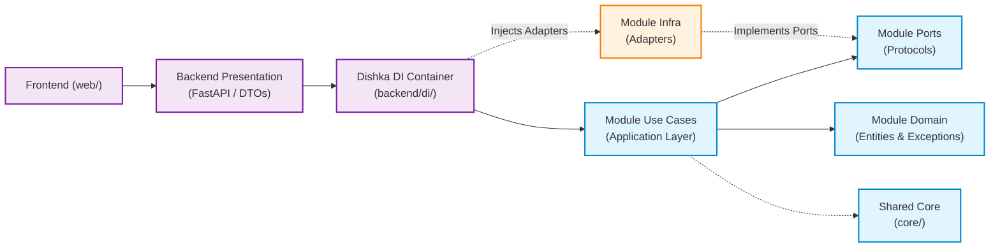

# Clean Architecture & Modular DDD Guidelines

Tài liệu này quy định cấu trúc mã nguồn theo mô hình **Modular Clean Architecture (Ports & Adapters / Hexagonal Architecture)** kết hợp **Domain-Driven Design (DDD)**, sử dụng **Dishka** làm IoC/DI Container cho dự án **RAG Viral Video**.

---

## 1. Cấu Trúc Thư Mục Chuẩn

Dự án phân tách triệt để giữa **Core (Cross-cutting / Shared Core)**, **Modules (Bounded Contexts theo nghiệp vụ)**, **Backend (Presentation API & DI Container)**, và **Web (Next.js Frontend)**:

```
rag-viral-video/
├── core/                                 # [CROSS-CUTTING / SHARED CORE]
│   ├── config.py                         # Settings & Environment variables (pydantic-settings)
│   ├── datetime_utils.py                 # Hàm xử lý thời gian chuẩn UTC (now_utc)
│   ├── exceptions.py                     # Custom Base Exception & Application Exceptions
│   ├── jwt.py                            # Tiện ích mã hóa & giải mã JWT Tokens
│   └── security.py                       # Hash mật khẩu (bcrypt / passlib)
│
├── module/                               # [MODULAR DOMAIN CONTEXTS]
│   ├── auth/                             # Bounded Context: Xác thực & Người dùng
│   │   ├── domain/                       # Pure Domain Entities & Domain Exceptions
│   │   │   └── entities/user.py          # User Entity & Value Objects
│   │   ├── port/                         # Ports / Protocols
│   │   │   └── user_repo.py              # IUserRepository Protocol
│   │   ├── use_case/                     # Application Services / Use Cases
│   │   │   ├── login.py                  # LoginUseCase
│   │   │   ├── register.py               # RegisterUseCase
│   │   │   ├── get_profile.py            # GetProfileUseCase
│   │   │   └── update_profile.py         # UpdateProfileUseCase
│   │   └── infra/                        # Infrastructure Adapters
│   │       ├── persistence/models/user.py# SQLAlchemy User ORM Model
│   │       └── repositories/users.py     # PostgresUserRepository (implements IUserRepository)
│   │
│   ├── upload/                           # Bounded Context: Upload tệp & S3 / MinIO
│   │   ├── domain/                       # Upload Entities & Exceptions
│   │   ├── port/                         # S3 Ports
│   │   │   └── s3_client.py              # IS3Client Protocol
│   │   ├── use_case/                     # Upload Use Cases
│   │   │   ├── upload_file.py            # UploadFileUseCase (bytes buffer)
│   │   │   └── presign_upload.py         # PresignUploadUseCase
│   │   └── infra/                        # S3 Infrastructure
│   │       └── clients/s3_client.py      # Boto3 S3 / MinIO Client Adapter
│   │
│   └── video_rag/                        # Bounded Context: Video RAG & Script Generation
│       ├── domain/                       # Core Video RAG Domain
│       │   ├── entities/                 # RawVideoRecord, ViralScript, Storyboard, Scene, Hook
│       │   ├── value_objects/            # HookType, PlatformTarget, VideoDuration
│       │   └── exceptions.py             # Pure Domain Validation & Business Errors
│       ├── port/                         # Ports (Python Protocols)
│       │   ├── llm_port.py               # ILLMPort
│       │   ├── embedding_port.py         # IEmbeddingPort
│       │   ├── vector_store_port.py      # IVectorStorePort
│       │   ├── session_store_port.py     # ISessionStorePort
│       │   └── data_reader_port.py       # IDataReaderPort
│       ├── use_case/                     # Use Cases điều phối kịch bản
│       │   ├── ingest_video_data.py      # Nạp và vector hóa dữ liệu kho video JSON
│       │   ├── search_viral_patterns.py  # Tìm kiếm pattern video tương đồng
│       │   ├── generate_viral_script.py  # Sinh kịch bản viral hoàn chỉnh qua RAG
│       │   └── chat_with_history.py      # Trò chuyện ngữ cảnh video RAG
│       └── infra/                        # Infrastructure Adapters
│           ├── llm/self_hosted_llm.py    # OpenAI-Compatible / Self-hosted LLM Adapter
│           ├── embeddings/self_hosted_embed.py # Self-hosted Embedding Adapter
│           ├── vector_store/             # ChromaVectorStoreAdapter, PgVectorAdapter
│           ├── session_store/memory.py   # InMemorySessionStoreAdapter
│           └── data_readers/json_reader.py # JSON Data Reader Adapter
│
├── backend/                              # [DELIVERY & PRESENTATION LAYER]
│   ├── di/                               # Dishka Dependency Injection Container
│   │   ├── providers.py                  # DatabaseSessionProvider, AuthModuleProvider, UploadModuleProvider, VideoRagModuleProvider
│   │   └── setup.py                      # make_async_container()
│   ├── presentation/                     # Giao diện Web API
│   │   ├── api/v1/                       # FastAPI Endpoints
│   │   │   ├── auth.py                   # /api/v1/auth (login, register)
│   │   │   ├── me.py                     # /api/v1/me (profile)
│   │   │   ├── uploads.py                # /api/v1/uploads (direct & presigned URL)
│   │   │   ├── video_rag.py              # /api/v1/video-rag (ingest, search, generate)
│   │   │   ├── chat.py                   # /api/v1/chat (conversational RAG)
│   │   │   ├── health.py                 # /api/v1/health
│   │   │   └── router.py                 # APIRouter tổng hợp
│   │   ├── exception_handlers.py         # Global Exception Handlers (Standard JSON format)
│   │   └── schemas/                      # Presentation DTOs & StandardResponse[T]
│   ├── static/                           # Web Chatbot Client UI (HTML/JS/CSS)
│   ├── tests/                            # Integration Tests cho API, Auth & Upload
│   └── main.py                           # FastAPI ASGI Application & Dishka setup
│
├── web/                                  # [FRONTEND LAYER - Next.js 15]
│   ├── src/                              # Components, Pages, Hooks, TanStack Query
│   ├── package.json
│   └── tailwind.config.js
│
├── alembic/                              # Quản lý Database Migrations (PostgreSQL)
│   ├── env.py
│   └── versions/
├── data/                                 # Storage cục bộ mẫu (JSON samples, ChromaDB)
├── tests/                                # Unit Tests (Core Video RAG & Mock Ports)
├── docker-compose.yml                    # PostgreSQL & MinIO local services
├── pyproject.toml                        # Quản lý dependencies (uv)
└── README.md
```

---

## 2. Quy Tắc Phụ Thuộc Bắt Buộc (Dependency Rules)



1. **Tuyệt đối cấm Domain & Use Cases import Frameworks:**
   * Trong các thư mục `module/<name>/domain/` và `module/<name>/use_case/`, **KHÔNG ĐƯỢC PHÉP** xuất hiện bất kỳ câu lệnh `import` nào trỏ tới `fastapi`, `starlette.datastructures.UploadFile`, `sqlalchemy.ext.asyncio`, `chromadb`, hay `boto3`.
   * Mọi dữ liệu vào Use Case đều ở dạng Pure Python Primitive Types, DTOs, hoặc domain Value Objects (ví dụ `bytes`, `str`, `int`, Stream Reader).
2. **Ports là ranh giới trừu tượng (Abstract Boundary):**
   * Được định nghĩa bằng Python `typing.Protocol` hoặc `abc.ABC` tại `module/<name>/port/`.
   * Tầng hạ tầng `module/<name>/infra/` bắt buộc phải implement các interface này.
3. **Quản lý Vòng Đời & Tiêm Phụ Thuộc Bằng Dishka (IoC):**
   * Toàn bộ việc khởi tạo Adapter, Session Database, và Use Case được cấu hình tập trung tại `backend/di/providers.py`.
   * Sử dụng Scope rõ ràng:
     * `Scope.APP`: Cấu hình singleton (Settings, S3 Client, Chroma Vector Store, LLM Adapter, Engine Database).
     * `Scope.REQUEST`: Cấu hình theo từng HTTP request (AsyncSession SQLAlchemy, Repositories, Use Cases).
4. **Xử lý Exception chuẩn hóa:**
   * Domain và Use Case ném ra Domain Exception (`AppException`, `EntityNotFoundError`, `AuthenticationError`, `DomainError`).
   * Tầng Presentation bắt qua `backend/presentation/exception_handlers.py` và trả về `StandardResponse` kèm HTTP Status Code tương ứng (400, 401, 404, 422, 500).

---

## 3. Tiêu Chuẩn Triển Khai Code Theo Từng Tầng

### 3.1. Tầng Domain: Entity & Pure Exceptions
Entity chứa logic nghiệp vụ cốt lõi, không chứa dependency:

```python
# module/video_rag/domain/entities/viral_script.py
from dataclasses import dataclass, field
from module.video_rag.domain.value_objects.hook_type import HookType

@dataclass
class Hook:
    hook_type: HookType
    script: str
    visual_action: str
    retention_rationale: str
    duration_seconds: int = 4
```

### 3.2. Tầng Port: Định Nghĩa Giao Thức (Protocol)
Sử dụng `typing.Protocol` để định nghĩa cổng kết nối độc lập:

```python
# module/video_rag/port/llm_port.py
from typing import Protocol, Any
from module.video_rag.domain.entities.viral_script import ViralScript

class ILLMPort(Protocol):
    async def generate_script(
        self,
        system_prompt: str,
        user_prompt: str,
        reference_context: str,
    ) -> ViralScript:
        """Gửi prompt tới LLM và nhận về kịch bản đã được parse chuẩn."""
        ...
```

### 3.3. Tầng Use Case: Nghiệp Vụ Ứng Dụng (Constructor Injection)
Use Case chỉ nhận Ports qua Constructor, không biết tới công nghệ lưu trữ hay thư viện ngoài:

```python
# module/video_rag/use_case/generate_viral_script.py
from module.video_rag.port.llm_port import ILLMPort
from module.video_rag.port.embedding_port import IEmbeddingPort
from module.video_rag.port.vector_store_port import IVectorStorePort
from module.video_rag.domain.entities.viral_script import ViralScript

class GenerateViralScriptUseCase:
    def __init__(
        self,
        llm_port: ILLMPort,
        embedding_port: IEmbeddingPort,
        vector_store_port: IVectorStorePort,
    ) -> None:
        self._llm = llm_port
        self._embed = embedding_port
        self._vector_store = vector_store_port

    async def execute(self, topic: str, duration: int) -> ViralScript:
        query_vector = await self._embed.embed_text(topic)
        similar_videos = await self._vector_store.search(query_vector, top_k=5)
        return await self._llm.generate_script(
            system_prompt="...",
            user_prompt=f"Topic: {topic}",
            reference_context=str(similar_videos),
        )
```

### 3.4. Tầng Infra: Adapter Hiện Thực Hóa Port
```python
# module/video_rag/infra/llm/self_hosted_llm.py
import httpx
from module.video_rag.port.llm_port import ILLMPort
from module.video_rag.domain.entities.viral_script import ViralScript

class SelfHostedLLMAdapter(ILLMPort):
    def __init__(self, api_base_url: str, api_key: str = "") -> None:
        self._api_base_url = api_base_url
        self._api_key = api_key

    async def generate_script(
        self, system_prompt: str, user_prompt: str, reference_context: str
    ) -> ViralScript:
        # Gọi HTTP request qua httpx tới endpoint self-hosted vLLM / Ollama
        ...
```

### 3.5. Tầng Presentation & Dishka IoC: Tích Hợp Vào FastAPI
Dishka tự động inject dependency vào FastAPI endpoint thông qua `FromDishka[...]`:

```python
# backend/presentation/api/v1/video_rag.py
from fastapi import APIRouter
from dishka.integrations.fastapi import FromDishka, inject
from module.video_rag.use_case.generate_viral_script import GenerateViralScriptUseCase
from backend.presentation.schemas.video_rag import GenerateScriptRequest
from backend.presentation.schemas.common import StandardResponse

router = APIRouter(prefix="/video-rag", tags=["Video RAG"])

@router.post("/generate-script", response_model=StandardResponse[dict])
@inject
async def generate_script(
    req: GenerateScriptRequest,
    use_case: FromDishka[GenerateViralScriptUseCase],
) -> StandardResponse[dict]:
    result = await use_case.execute(
        topic=req.topic,
        duration=req.duration_seconds,
    )
    return StandardResponse.success(data=result.to_dict())
```

---

## 4. Quy Chuẩn Kiểm Thử (Testing Strategy)

```
       ▲
      / \     E2E / Integration API Tests (`backend/tests/`)
     /   \    (Auth, Upload, FastAPI test client, SQLite/PostgreSQL)
    /-----\   Adapter Integration Tests (`tests/integration/`)
   /       \  (ChromaDB, S3 client, JSON Reader)
  /---------\ Unit Tests (`tests/unit/`)
              (Core Domain, Ports & Use Cases với Fakes/Mocks)
```

1. **Unit Tests (`tests/unit/`):**
   * Tập trung 100% vào logic Use Case và Domain Entities.
   * Sử dụng Mock hoặc Fake Adapters (`FakeLLMAdapter`, `FakeEmbeddingAdapter`, `InMemoryVectorStore`).
   * Tốc độ thực thi siêu nhanh (mili-giây), không cần internet hay database.
2. **Integration Tests (`backend/tests/`):**
   * Kiểm thử tích hợp các luồng xác thực (JWT, login, register), tải tệp lên S3 / MinIO, và luồng giải phóng Dishka request container.
   * Chạy toàn diện bằng:
   ```bash
   pytest
   ```
