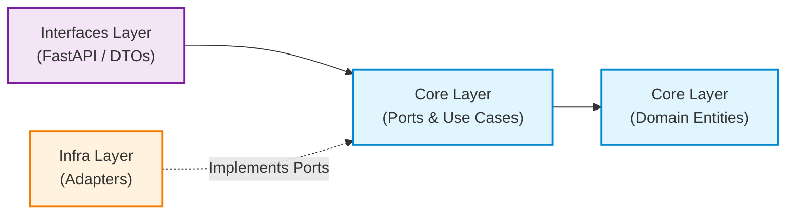

# Clean Architecture Guidelines

Tài liệu này quy định cấu trúc mã nguồn theo mô hình **Clean Architecture (Ports & Adapters / Hexagonal Architecture)**, các quy tắc phụ thuộc và tiêu chuẩn kiểm thử cho dự án **RAG Viral Video**.

---

## 1. Cấu Trúc Thư Mục Chuẩn

Dự án phân tách triệt để giữa **Core (Nghiệp vụ cốt lõi)** và **Infra (Hạ tầng kỹ thuật & thư viện ngoài)**:

```
rag-viral-video/
├── docs/                                 # Tài liệu thiết kế & đặc tả hệ thống
│   ├── project-overview-prd.md           # Đặc tả yêu cầu sản phẩm (PRD)
│   ├── system-architecture.md            # Kiến trúc hệ thống & sơ đồ Mermaid
│   └── clean-architecture.md             # Hướng dẫn Clean Architecture (File này)
├── .agents/                              # Kỹ năng (Skills) của AI Agents
│   └── skills/                           # 61 skills chuyên biệt
├── src/                                  # Mã nguồn ứng dụng
│   ├── core/                             # [TẦNG CORE] - ĐỘC LẬP HOÀN TOÀN
│   │   ├── domain/                       # Entities, Value Objects, Domain Exceptions
│   │   │   ├── entities/                 # RawVideoRecord, ViralScript, Storyboard, Scene, Hook
│   │   │   ├── value_objects/            # HookType, PlatformTarget, VideoDuration
│   │   │   └── exceptions.py             # Domain validation & business errors
│   │   ├── ports/                        # Ports (Giao diện trừu tượng / Python Protocols)
│   │   │   ├── llm_port.py               # ILLMPort
│   │   │   ├── embedding_port.py         # IEmbeddingPort
│   │   │   ├── vector_store_port.py      # IVectorStorePort
│   │   │   └── data_reader_port.py       # IDataReaderPort
│   │   └── use_cases/                    # Use Cases (Kịch bản điều phối nghiệp vụ)
│   │       ├── generate_viral_script.py  # Tạo kịch bản viral hoàn chỉnh qua RAG
│   │       ├── ingest_video_data.py      # Nạp và vector hóa dữ liệu kho video JSON
│   │       └── search_viral_patterns.py  # Tìm kiếm pattern video tương đồng
│   │
│   ├── infra/                            # [TẦNG INFRA] - ADAPTERS HIỆN THỰC PORTS
│   │   ├── config/
│   │   │   └── settings.py               # Cấu hình môi trường (pydantic-settings)
│   │   ├── llm/
│   │   │   └── self_hosted_llm.py        # Triển khai ILLMPort với Self-hosted LLM API
│   │   ├── embeddings/
│   │   │   └── self_hosted_embed.py      # Triển khai IEmbeddingPort với Embedding API riêng
│   │   ├── vector_store/
│   │   │   └── chroma_adapter.py         # Triển khai IVectorStorePort với ChromaDB Persistent
│   │   └── data_readers/
│   │       └── json_reader_adapter.py    # Triển khai IDataReaderPort đọc JSON kho video
│   │
│   └── interfaces/                       # [TẦNG GIAO DIỆN] - DELIVERY & DI
│       └── api/
│           ├── v1/
│           │   ├── routes/               # FastAPI endpoints
│           │   │   ├── generation.py
│           │   │   ├── ingestion.py
│           │   │   ├── search.py
│           │   │   └── health.py
│           │   └── router.py             # APIRouter tổng hợp
│           ├── schemas/                  # Request / Response DTOs
│           │   ├── request_dtos.py
│           │   └── response_dtos.py
│           └── dependencies.py           # Dependency Injection container
│
├── tests/                                # Testing Suite
│   ├── unit/                             # Test độc lập cho Core (sử dụng Mocks/Fakes)
│   │   ├── domain/
│   │   └── use_cases/
│   └── integration/                      # Test tích hợp cho Tầng Infra
│       ├── test_chroma_adapter.py
│       └── test_json_reader.py
├── pyproject.toml
├── main.py                               # Entrypoint khởi chạy ứng dụng FastAPI
└── README.md
```

---

## 2. Quy Tắc Phụ Thuộc Bắt Buộc (Dependency Rules)



1. **Tuyệt đối cấm Core import Infra hoặc Frameworks:**
   * Trong thư mục `src/core/`, **KHÔNG ĐƯỢC PHÉP** xuất hiện bất kỳ câu lệnh `import` nào trỏ tới `infra`, `interfaces`, hay các thư viện hạ tầng bên ngoài như `fastapi`, `chromadb`, `httpx`, `requests`.
   * Mọi tương tác ra bên ngoài từ Use Case phải đi qua các giao diện định nghĩa tại `core/ports/` bằng Python `Protocol` hoặc `ABC` (Abstract Base Class).
2. **Infra phụ thuộc Core:**
   * Các class trong `infra/` bắt buộc phải kế thừa hoặc tuân thủ protocol của Port tương ứng trong `core/ports/`.
   * Ví dụ: `class SelfHostedLLMAdapter(ILLMPort): ...`
3. **Dependency Injection (DI) tại tầng ngoài cùng:**
   * Tầng `interfaces/` (cụ thể là `interfaces/api/dependencies.py`) là nơi duy nhất khởi tạo các Adapter cụ thể của Infra và truyền (inject) vào Use Case của Core.
4. **Domain là trung tâm:**
   * Domain Entities (`RawVideoRecord`, `ViralScript`, `Hook`, `Scene`) chứa các quy tắc nghiệp vụ bất biến và hoàn toàn thuần khiết (pure Python).

---

## 3. Tiêu Chuẩn Viết Code Theo Từng Tầng

### 3.1. Tầng Core: Ports (Interfaces)
Sử dụng `typing.Protocol` hoặc `abc.ABC`:

```python
# src/core/ports/llm_port.py
from typing import Protocol
from src.core.domain.entities.viral_script import ViralScript

class ILLMPort(Protocol):
    async def generate_script(
        self, 
        system_prompt: str, 
        user_prompt: str, 
        reference_context: str
    ) -> ViralScript:
        """Gửi prompt tới LLM và nhận về kịch bản đã được parse chuẩn."""
        ...
```

### 3.2. Tầng Core: Use Case
Use Case chỉ nhận Ports thông qua Constructor Injection:

```python
# src/core/use_cases/generate_viral_script.py
from src.core.ports.llm_port import ILLMPort
from src.core.ports.embedding_port import IEmbeddingPort
from src.core.ports.vector_store_port import IVectorStorePort
from src.core.domain.entities.viral_script import ViralScript

class GenerateViralScriptUseCase:
    def __init__(
        self,
        llm_port: ILLMPort,
        embedding_port: IEmbeddingPort,
        vector_store_port: IVectorStorePort,
    ) -> None:
        self._llm = llm_port
        self._embed = embedding_port
        self._vector_store = vector_store_port

    async def execute(self, topic: str, duration: int) -> ViralScript:
        # 1. Embed query
        query_vector = await self._embed.embed_text(topic)
        # 2. Retrieve top-k patterns
        similar_videos = await self._vector_store.search(query_vector, top_k=5)
        # 3. Augment prompt & call LLM
        return await self._llm.generate_script(...)
```

### 3.3. Tầng Infra: Adapter
Hiện thực hóa Port, xử lý chi tiết kỹ thuật (HTTP request, serialization, exceptions):

```python
# src/infra/llm/self_hosted_llm.py
import httpx
from src.core.ports.llm_port import ILLMPort
from src.core.domain.entities.viral_script import ViralScript

class SelfHostedLLMAdapter(ILLMPort):
    def __init__(self, api_base_url: str, api_key: str | None = None) -> None:
        self._api_base_url = api_base_url
        self._api_key = api_key

    async def generate_script(
        self, system_prompt: str, user_prompt: str, reference_context: str
    ) -> ViralScript:
        # Gọi API HTTP thực tế (vLLM, Ollama, TGI...)
        ...
```

### 3.4. Tầng Interfaces: Dependency Injection
Ghép nối Adapters vào Use Case:

```python
# src/interfaces/api/dependencies.py
from fastapi import Depends
from src.infra.config.settings import get_settings
from src.infra.llm.self_hosted_llm import SelfHostedLLMAdapter
from src.infra.embeddings.self_hosted_embed import SelfHostedEmbeddingAdapter
from src.infra.vector_store.chroma_adapter import ChromaVectorStoreAdapter
from src.core.use_cases.generate_viral_script import GenerateViralScriptUseCase

def get_generate_script_use_case(
    settings = Depends(get_settings)
) -> GenerateViralScriptUseCase:
    llm_adapter = SelfHostedLLMAdapter(api_base_url=settings.LLM_API_BASE_URL)
    embed_adapter = SelfHostedEmbeddingAdapter(api_base_url=settings.EMBEDDING_API_BASE_URL)
    chroma_adapter = ChromaVectorStoreAdapter(persist_dir=settings.CHROMA_PERSIST_DIR)
    
    return GenerateViralScriptUseCase(
        llm_port=llm_adapter,
        embedding_port=embed_adapter,
        vector_store_port=chroma_adapter
    )
```

---

## 4. Quy Chuẩn Kiểm Thử (Testing Strategy)

```
       ▲
      / \     E2E Tests (FastAPI Client)
     /   \    
    /-----\   Integration Tests (ChromaDB, JSON Reader)
   /       \  
  /---------\ Unit Tests (Core Use Cases + Domain với Fake Adapters)
```

1. **Unit Tests (`tests/unit/`):**
   * Tập trung 100% vào `core/`.
   * Sử dụng Fake Adapters (`FakeLLMAdapter`, `FakeEmbeddingAdapter`, `InMemoryVectorStore`).
   * Không phụ thuộc mạng internet, không phụ thuộc database, thời gian chạy tính bằng mili-giây.
2. **Integration Tests (`tests/integration/`):**
   * Kiểm thử các Adapters ở tầng `infra/` (đọc file JSON thực tế, test lưu trữ ChromaDB trên đĩa).
