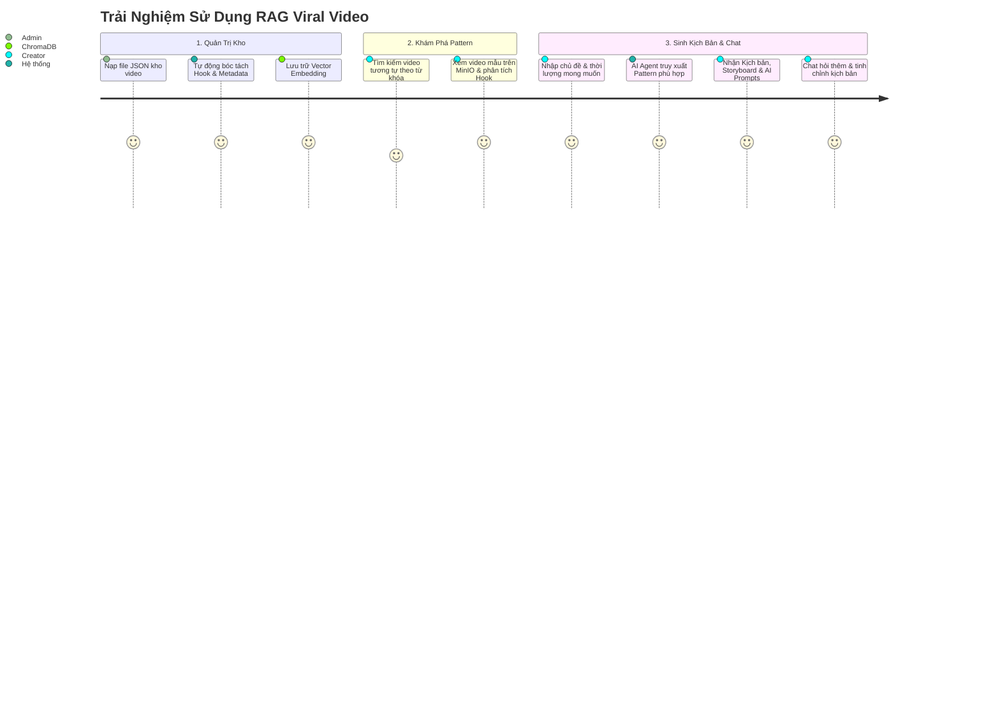

# Product Requirements Document (PRD) — RAG Viral Video

> **Nền tảng AI Agent tự động phân tích pattern video viral và tạo kịch bản, storyboard, prompts cho video ngắn đa nền tảng (TikTok, Reels, YouTube Shorts) ứng dụng RAG và kiến trúc Modular Clean Architecture.**

---

## 1. Bối Cảnh & Vấn Đề (The Problem)

Trong sản xuất nội dung video ngắn (Short-form Video):
1. **Thiếu tính giữ chân (Retention):** 3-5 giây đầu quyết định tới 80% tỷ lệ người xem lướt qua hay ở lại. Kịch bản thông thường do LLM tạo ra thường thiếu các công thức Hook tâm lý đã được chứng minh hiệu quả.
2. **Kịch bản chung chung, thiếu bối cảnh thực tế:** Các kịch bản do ChatGPT hay Claude tự sinh không nắm bắt được văn phong, từ khoá thịnh hành (slang, trend) và nhịp điệu (pacing) của các video đã thực sự đạt triệu view trên TikTok/Reels.
3. **Mất nhiều thời gian chuyển dịch từ Kịch bản sang Sản xuất:** Người sáng tạo nội dung không chỉ cần lời thoại (Narration), mà cần:
   * Mô tả hình ảnh / B-roll chi tiết từng giây.
   * Prompts tối ưu hóa sẵn cho AI tạo hình ảnh (Midjourney, Flux, Stable Diffusion).
   * Prompts camera movement cho AI tạo video (Veo 3.1, Runway, Kling).
   * Gợi ý hiệu ứng âm thanh (SFX) và nhịp nhạc nền.

👉 **RAG Viral Video** giải quyết bài toán này bằng cách kết nối **kho video viral đã thu thập sẵn** (chứa transcript, caption, hashtag, tóm tắt và video MinIO) với **AI Agent** để phân tích mẫu kịch bản thành công và sinh ra kịch bản hoàn chỉnh chuẩn quy trình sản xuất.

---

## 2. Mục Tiêu & Phạm Vi (Goals & Scope)

### 2.1. Mục Tiêu Cốt Lõi (Core Objectives)
* **Tận dụng kho dữ liệu có sẵn:** Ingest dữ liệu video dạng JSON vào Vector Database (ChromaDB / pgvector) thông qua mô hình Embedding riêng.
* **RAG Retrieval chính xác:** Khi người dùng cung cấp một chủ đề (topic), hệ thống tự động tìm kiếm các video có cấu trúc hook, phong cách hoặc nội dung tương đồng trong kho.
* **Sinh kịch bản chi tiết (1-Click):** Sử dụng LLM self-hosted để xuất ra kịch bản phân cảnh chuẩn xác theo từng khoảng thời gian (00:00 - 00:04, 00:04 - 00:09...), bao gồm:
  1. Lời thoại voiceover.
  2. Mô tả hình ảnh và hành động nhân vật / B-roll.
  3. Image Prompts cho Midjourney / Flux.
  4. Video Prompts cho Veo 3.1 / Runway Gen-3 / Kling.
  5. Audio SFX & Background music cues.
* **Hội thoại tương tác (Conversational RAG):** Cho phép người dùng trò chuyện, tinh chỉnh kịch bản hoặc hỏi sâu về pattern video dựa trên ngữ cảnh lịch sử.
* **Hệ thống phân quyền & quản lý tệp:** Xác thực tài khoản người dùng JWT, phân quyền, và hỗ trợ tải tệp (thumbnails, raw video) lên S3/MinIO trực tiếp hoặc qua presigned URLs.
* **Cung cấp REST API & Frontend Hiện Đại:** Backend FastAPI chuẩn hóa với Dishka DI và giao diện web Next.js 15.

### 2.2. Ngoài Phạm Vi (Out of Scope giai đoạn này)
* Không render trực tiếp file video MP4 (việc tạo video bằng Remotion/FFmpeg được tách thành module độc lập sau này).
* Không trực tiếp gọi API trả phí từ bên ngoài mà tập trung sử dụng hạ tầng mô hình **self-hosted** (vLLM, Ollama) và kho MinIO nội bộ.

---

## 3. Cấu Trúc Dữ Liệu Đầu Vào (Data Contract)

Dữ liệu kho video có định dạng JSON chuẩn thống nhất:

| Trường Chuẩn (Key) | Kiểu Dữ Liệu | Mục Đích Trong RAG |
|--------------------|--------------|---------------------|
| `caption` | `string` | Tiêu đề hoặc mô tả bài đăng (context & hook) |
| `hashtag` | `string` / `list[string]` | Thẻ hashtag phân loại chủ đề, xu hướng |
| `transcript` | `string` | Toàn bộ lời thoại video (vector hóa & học nhịp kịch bản) |
| `image_url` | `string` | URL ảnh thumbnail hoặc keyframe của video |
| `summary` | `string` | Tóm tắt ý chính của video (ngữ cảnh vector search) |
| `video_url` | `string` | Đường dẫn file video gốc lưu trữ tại MinIO Storage |

---

## 4. Đặc Tả Chức Năng (Functional Requirements)

### FR-1: Quản Trị & Nạp Kho Video (`POST /api/v1/video-rag/ingest`)
* Tiếp nhận file JSON từ hệ thống lưu trữ cục bộ hoặc payload.
* Tự động làm sạch văn bản, trích xuất 3-5 giây đầu làm ứng viên Hook.
* Sinh vector embedding thông qua Self-hosted Embedding model.
* Lưu trữ vào ChromaDB kèm metadata đầy đủ để truy vấn ngược lại link MinIO.

### FR-2: Tìm Kiếm Pattern Viral (`POST /api/v1/video-rag/search-patterns`)
* Cho phép người dùng tìm kiếm theo ngữ nghĩa (semantic search) các video có cùng chủ đề hoặc phong cách.
* Trả về danh sách Top-K video tương đồng kèm điểm số tương đồng (similarity score), hook mẫu và link video MinIO để người dùng xem tham khảo.

### FR-3: Sinh Kịch Bản & Storyboard Tự Động (`POST /api/v1/video-rag/generate-script`)
* **Đầu vào (Request):**
  * `topic`: Chủ đề video cần làm.
  * `target_audience`: Đối tượng người xem mục tiêu.
  * `duration_seconds`: Thời lượng video (ví dụ 30, 45, 60 giây).
  * `hook_style`: (Tùy chọn) Phong cách hook mong muốn (Shocking, Contrarian, Question, Story...).
  * `platform`: Nền tảng đích (TikTok, YouTube Shorts, Instagram Reels).
* **Đầu ra (Response):**
  * `ViralScript` hoàn chỉnh bao gồm Hook, giải thích tâm lý giữ chân (retention rationale), Storyboard từng giây kèm Visual & Audio Prompts, Call To Action, và các nguồn video tham khảo từ kho MinIO.

### FR-4: Trò Chuyện Điều Chỉnh Kịch Bản (`POST /api/v1/chat/message`)
* Cho phép người dùng tiếp tục đặt câu hỏi, yêu cầu viết lại đoạn hook hoặc thay đổi phong cách storyboard.
* Quản lý phiên hội thoại thông qua `session_id` và kết hợp ngữ cảnh kho video RAG.

### FR-5: Xác Thực & Quản Lý Người Dùng (`/api/v1/auth/*` & `/api/v1/me`)
* Đăng ký tài khoản (`POST /api/v1/auth/register`), đăng nhập (`POST /api/v1/auth/login`).
* Trả về JWT Access Token để bảo vệ các endpoints nhạy cảm.
* Lấy và cập nhật thông tin người dùng (`GET /api/v1/me`, `PUT /api/v1/me`).

### FR-6: Quản Lý Upload Tệp S3 / MinIO (`/api/v1/uploads/*`)
* Upload trực tiếp tệp (`POST /api/v1/uploads/direct`).
* Tạo URL presigned cho client upload trực tiếp lên bucket (`POST /api/v1/uploads/presign`).

---

## 5. Yêu Cầu Phi Chức Năng (Non-Functional Requirements)

1. **Tuân thủ Modular Clean Architecture & DDD:** Domain Entities và Use Cases độc lập hoàn toàn với framework và hạ tầng.
2. **Quản trị Dependency Injection bằng Dishka:** Vòng đời tài nguyên rõ ràng theo `Scope.APP` và `Scope.REQUEST`, tránh rò rỉ kết nối database.
3. **Lưu trữ dữ liệu tin cậy:**
   * PostgreSQL + Alembic quản lý người dùng và nghiệp vụ giao dịch.
   * ChromaDB / pgvector tối ưu cho lưu trữ vector embedding.
   * MinIO lưu trữ video, thumbnail và các tệp tài nguyên.
4. **Hiệu năng & Khả năng mở rộng:** Phản hồi truy vấn RAG dưới 100ms; xử lý bất đồng bộ toàn diện với `asyncio`.
