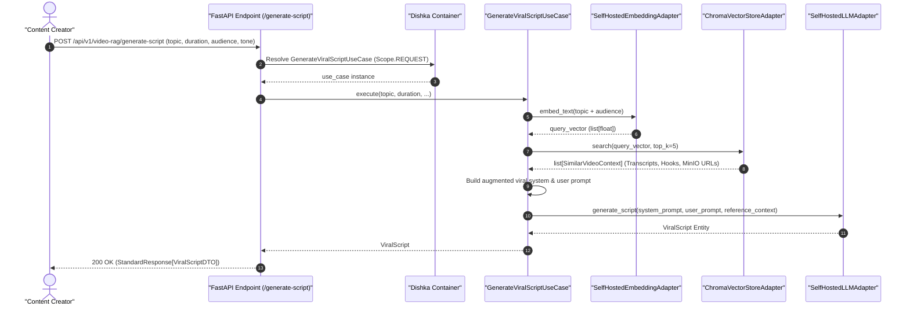
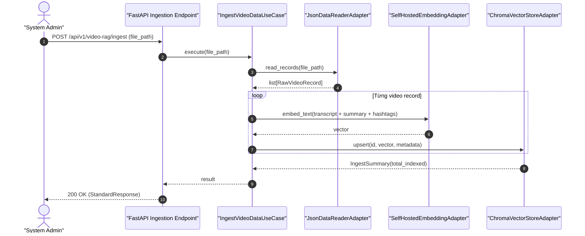
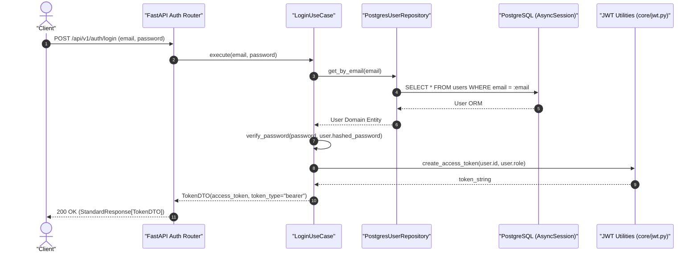

# System Architecture & Technical Specifications (Modular Clean Architecture & DDD)

Tài liệu này đặc tả kiến trúc kỹ thuật của hệ thống **RAG Viral Video** tuân thủ triệt để nguyên lý **Modular Clean Architecture (Hexagonal / Ports & Adapters)** kết hợp **Domain-Driven Design (DDD)** và **Dishka IoC Container**.

Quy tắc cốt lõi: **Core Code và Infra Code hoàn toàn độc lập và tách biệt. Mọi module nghiệp vụ được đóng gói độc lập theo Bounded Context.**

---

## 1. Nguyên Tắc Thiết Kế Kiến Trúc (The Dependency Rule)

Tất cả các thành phần trong hệ thống tuân thủ nghiêm ngặt **Quy tắc Phụ thuộc (Dependency Rule)**:
* Các tầng bên trong (Domain & Use Cases) **tuyệt đối không phụ thuộc** và **không được phép import** bất kỳ thành phần nào của tầng bên ngoài (Infra, Frameworks như FastAPI, SQLAlchemy, ChromaDB, Boto3).
* Mọi giao tiếp từ Core/Use Cases ra bên ngoài đều thông qua các **Giao diện trừu tượng (Ports / Protocols)**.
* Tầng Hạ tầng (Infra) đóng vai trò là các **Adapters** hiện thực hóa (implement) các Ports đó.
* Tầng Presentation (`backend/presentation`) đóng vai trò điều phối HTTP request, validate DTOs và dựa vào **Dishka** để giải quyết dependency injection theo Scope.

```mermaid
flowchart TD
    subgraph ClientLayer["1. Client Layer"]
        WEB["Next.js 15 Frontend (web/)"]
        STATIC_CHAT["Static Chat UI (backend/static)"]
    end

    subgraph PresentationLayer["2. Presentation Layer (backend/)"]
        FASTAPI["FastAPI App (backend/main.py)"]
        ROUTERS["API v1 Routers (/auth, /me, /uploads, /video-rag, /chat)"]
        DISHKA["Dishka IoC Container (backend/di/)<br/>Scope.APP | Scope.REQUEST"]
    end

    subgraph ModuleLayer["3. Domain Modules (module/)"]
        subgraph AuthModule["module/auth"]
            AUTH_UC["Use Cases: Login, Register, Profile"]
            AUTH_PORTS["Ports: IUserRepository"]
            AUTH_DOMAIN["Domain: User Entity, Roles"]
        end

        subgraph UploadModule["module/upload"]
            UPLOAD_UC["Use Cases: UploadFile, PresignUpload"]
            UPLOAD_PORTS["Ports: IS3Client"]
            UPLOAD_DOMAIN["Domain: Upload Entities"]
        end

        subgraph VideoRagModule["module/video_rag"]
            RAG_UC["Use Cases: Ingest, Search, Generate, Chat"]
            RAG_PORTS["Ports: ILLMPort, IEmbeddingPort<br/>IVectorStorePort, ISessionStorePort, IDataReaderPort"]
            RAG_DOMAIN["Domain: RawVideoRecord, ViralScript<br/>Hook, Storyboard, Scene, Prompts"]
        end
    end

    subgraph InfraAdapters["4. Infrastructure Adapters (module/*/infra)"]
        PG_REPO["PostgreSQL User Repo (SQLAlchemy Async)"]
        S3_ADAPTER["Boto3 S3 / MinIO Adapter"]
        CHROMA_ADAPTER["ChromaDB / PgVector Adapter"]
        LLM_ADAPTER["Self-hosted LLM Adapter (OpenAI Compatible)"]
        EMBED_ADAPTER["Self-hosted Embedding Adapter"]
        SESSION_MEM["In-Memory Session Store Adapter"]
        JSON_READER["JSON Data Reader Adapter"]
    end

    subgraph ExternalServices["5. External & Persistent Storage"]
        POSTGRES[("PostgreSQL Database<br/>(Alembic Migrations)")]
        MINIO[("MinIO / S3 Storage<br/>(Video & Thumbnail Assets)")]
        CHROMA_DB[("ChromaDB / Vector Storage")]
        LLM_SERVER["Self-hosted LLM Engine (vLLM / Ollama)"]
    end

    ClientLayer --> FASTAPI
    FASTAPI --> ROUTERS
    ROUTERS --> DISHKA
    DISHKA --> AUTH_UC
    DISHKA --> UPLOAD_UC
    DISHKA --> RAG_UC

    AUTH_UC --> AUTH_DOMAIN
    AUTH_UC --> AUTH_PORTS
    UPLOAD_UC --> UPLOAD_DOMAIN
    UPLOAD_UC --> UPLOAD_PORTS
    RAG_UC --> RAG_DOMAIN
    RAG_UC --> RAG_PORTS

    PG_REPO -.->|Implements| AUTH_PORTS
    S3_ADAPTER -.->|Implements| UPLOAD_PORTS
    CHROMA_ADAPTER -.->|Implements| RAG_PORTS
    LLM_ADAPTER -.->|Implements| RAG_PORTS
    EMBED_ADAPTER -.->|Implements| RAG_PORTS
    SESSION_MEM -.->|Implements| RAG_PORTS
    JSON_READER -.->|Implements| RAG_PORTS

    PG_REPO --> POSTGRES
    S3_ADAPTER --> MINIO
    CHROMA_ADAPTER --> CHROMA_DB
    LLM_ADAPTER --> LLM_SERVER

    classDef client fill:#f3e5f5,stroke:#7b1fa2,stroke-width:2px;
    classDef pres fill:#e8eaf6,stroke:#3f51b5,stroke-width:2px;
    classDef domain fill:#e1f5fe,stroke:#0288d1,stroke-width:2px;
    classDef infra fill:#fff3e0,stroke:#f57c00,stroke-width:2px;
    classDef external fill:#e8f5e9,stroke:#388e3c,stroke-width:2px;

    class WEB,STATIC_CHAT client;
    class FASTAPI,ROUTERS,DISHKA pres;
    class AUTH_UC,AUTH_PORTS,AUTH_DOMAIN,UPLOAD_UC,UPLOAD_PORTS,UPLOAD_DOMAIN,RAG_UC,RAG_PORTS,RAG_DOMAIN domain;
    class PG_REPO,S3_ADAPTER,CHROMA_ADAPTER,LLM_ADAPTER,EMBED_ADAPTER,SESSION_MEM,JSON_READER infra;
    class POSTGRES,MINIO,CHROMA_DB,LLM_SERVER external;
```



---

## 2. Phân Tách Chi Tiết Theo Từng Module & Tầng

### 2.1. Tầng Shared Core (`core/`)
* Chứa các tiện ích dùng chung (cross-cutting concerns) xuyên suốt các module:
  * `core/config.py`: Quản lý tập trung toàn bộ biến môi trường (`Settings`) bằng `pydantic-settings`.
  * `core/jwt.py`: Tạo, decode và xác thực JSON Web Token (Access Token).
  * `core/security.py`: Băm và kiểm tra mật khẩu bằng `pwd_context` (bcrypt).
  * `core/datetime_utils.py`: Cung cấp hàm `now_utc()` trả về thời gian chuẩn UTC không phụ thuộc múi giờ máy chủ.
  * `core/exceptions.py`: Phân cấp Exception nền tảng (`AppException`, `EntityNotFoundError`, `AuthenticationError`, `DomainError`).

### 2.2. Module Bounded Contexts (`module/`)

#### 1. Module `auth` (`module/auth/`)
* **Domain:** Thực thể `User` (id, email, hashed_password, full_name, role, is_active, timestamps).
* **Port:** `IUserRepository` (giao thức trừu tượng: `get_by_id`, `get_by_email`, `create`, `update`).
* **Use Cases:**
  * `LoginUseCase`: Xác thực tài khoản và sinh JWT token.
  * `RegisterUseCase`: Đăng ký tài khoản mới, kiểm tra trùng email, băm mật khẩu.
  * `GetProfileUseCase` & `UpdateProfileUseCase`: Lấy và cập nhật thông tin cá nhân.
* **Infra:**
  * `persistence/models/user.py`: SQLAlchemy ORM Model ánh xạ tới bảng `users` trong PostgreSQL.
  * `repositories/users.py`: `PostgresUserRepository` thực thi các truy vấn bất đồng bộ qua `AsyncSession`.

#### 2. Module `upload` (`module/upload/`)
* **Port:** `IS3Client` (giao thức tải file, tạo presigned URL, kiểm tra tệp tin).
* **Use Cases:**
  * `UploadFileUseCase`: Nhận file stream/bytes thuần túy từ Presentation, tải lên bucket S3/MinIO và trả về URL công khai.
  * `PresignUploadUseCase`: Sinh URL presigned để client trực tiếp upload lên S3/MinIO mà không cần tải qua backend server.
* **Infra:** `clients/s3_client.py` (sử dụng thư viện `boto3` và endpoint MinIO nội bộ).

#### 3. Module `video_rag` (`module/video_rag/`)
* **Domain:**
  * `RawVideoRecord`: Đại diện cho bản ghi video gốc trong kho JSON/MinIO.
  * `ViralScript`, `Storyboard`, `Scene`, `Hook`, `CallToAction`: Cấu trúc kịch bản phân cảnh theo từng giây.
  * `Value Objects`: `HookType`, `PlatformTarget`, `VideoDuration`.
* **Port:**
  * `ILLMPort`: Giao tiếp với LLM.
  * `IEmbeddingPort`: Chuyển đổi văn bản thành vector.
  * `IVectorStorePort`: Lưu trữ và truy vấn vector k-NN.
  * `ISessionStorePort`: Quản lý phiên hội thoại RAG.
  * `IDataReaderPort`: Nạp và chuẩn hóa dữ liệu kho video.
* **Use Cases:**
  * `IngestVideoDataUseCase`: Đọc file kho video -> Trích xuất Hook & Transcript -> Embedding -> Upsert vào Vector Store.
  * `SearchViralPatternsUseCase`: Semantic search các pattern video tương đồng kèm điểm tương đồng và video MinIO tham khảo.
  * `GenerateViralScriptUseCase`: RAG Pipeline hoàn chỉnh: Vectorize nhu cầu -> Lấy top mẫu viral -> Ghép Prompt tối ưu -> Gọi LLM -> Trả về kịch bản chi tiết từng giây.
  * `ChatWithHistoryUseCase`: Trò chuyện điều chỉnh kịch bản giữ nguyên bối cảnh lịch sử phiên.
* **Infra:**
  * `infra/llm/self_hosted_llm.py`: Hỗ trợ OpenAI-compatible API (vLLM, Ollama, TGI, Llama.cpp).
  * `infra/embeddings/self_hosted_embed.py`: Gọi endpoint embedding vector.
  * `infra/vector_store/chroma_adapter.py`: Adapter kết nối ChromaDB Persistent.
  * `infra/session_store/memory.py`: Bộ nhớ lưu trữ phiên chat ngắn hạn.
  * `infra/data_readers/json_reader.py`: Parser linh hoạt nạp kho video.

### 2.3. Tầng Delivery / Presentation (`backend/`)
* **`backend/di/`**: Cấu hình Dishka Container:
  * `DatabaseSessionProvider`: Quản lý vòng đời kết nối `AsyncEngine` (`Scope.APP`) và `AsyncSession` (`Scope.REQUEST`). Tự động `commit()` khi request thành công, `rollback()` khi gặp lỗi.
  * `AuthModuleProvider`, `UploadModuleProvider`, `VideoRagModuleProvider`: Tự động instantiate và inject các dependencies tương ứng.
* **`backend/presentation/api/v1/`**:
  * Các routes FastAPI nhận request DTOs, gọi Use Case qua Dishka `@inject` và trả về `StandardResponse[T]`.
  * `exception_handlers.py`: Bắt mọi `AppException` và `RequestValidationError`, format theo chuẩn JSON thống nhất.
* **`backend/static/`**: Client chat UI hoàn chỉnh được phục vụ trực tiếp tại `/app` hoặc `/chat`.

---

## 3. Quy Trình Hoạt Động (Mermaid Sequence Diagrams)

### 3.1. Luồng Sinh Kịch Bản RAG (`POST /api/v1/video-rag/generate-script`)



### 3.2. Luồng Nạp Kho Dữ Liệu Video (`POST /api/v1/video-rag/ingest`)



### 3.3. Luồng Xác Thực Người Dùng (`POST /api/v1/auth/login`)



---

## 4. Cấu Trúc Thư Mục Chi Tiết (Repository Layout)

```
rag-viral-video/
├── core/                                 # Cross-cutting utilities (Zero frameworks)
│   ├── config.py                         # Settings qua pydantic-settings
│   ├── datetime_utils.py                 # now_utc()
│   ├── exceptions.py                     # Custom application exceptions
│   ├── jwt.py                            # JWT encode/decode
│   └── security.py                       # Password hashing
│
├── module/                               # Domain Bounded Contexts
│   ├── auth/                             # User Authentication & Profiles
│   │   ├── domain/                       # User entities
│   │   ├── port/                         # IUserRepository
│   │   ├── use_case/                     # Login, Register, Profile use cases
│   │   └── infra/                        # PostgresUserRepository, SQLAlchemy models
│   ├── upload/                           # Asset & File Uploads
│   │   ├── domain/                       # Upload entities
│   │   ├── port/                         # IS3Client
│   │   ├── use_case/                     # UploadFileUseCase, PresignUploadUseCase
│   │   └── infra/                        # Boto3 S3 Client Adapter
│   └── video_rag/                        # Video RAG & Script Generation
│       ├── domain/                       # ViralScript, Hook, Storyboard, Scene, Prompts
│       ├── port/                         # Ports: LLM, Embedding, VectorStore, SessionStore
│       ├── use_case/                     # Ingest, Search, Generate, Chat
│       └── infra/                        # ChromaDB, Self-hosted LLM/Embed, InMemory Session
│
├── backend/                              # Presentation & Delivery
│   ├── di/                               # Dishka IoC Configuration
│   │   ├── providers.py                  # Module Providers & Database Session Provider
│   │   └── setup.py                      # Container Factory
│   ├── presentation/
│   │   ├── api/v1/                       # API Endpoints (/auth, /uploads, /video-rag, /chat)
│   │   ├── exception_handlers.py         # Standardized Error Handling
│   │   └── schemas/                      # Presentation DTOs & StandardResponse
│   ├── static/                           # Interactive Chat UI Web Assets
│   ├── tests/                            # Auth & Upload API Integration Tests
│   └── main.py                           # FastAPI ASGI Application & Dishka lifespan
│
├── web/                                  # Next.js 15 App (React, Tailwind, Lucide)
├── alembic/                              # PostgreSQL Database Migrations
├── tests/                                # Core Domain & Unit Tests
├── docker-compose.yml                    # PostgreSQL & MinIO local containers
├── pyproject.toml                        # Project configuration & Dependencies
└── README.md
```
