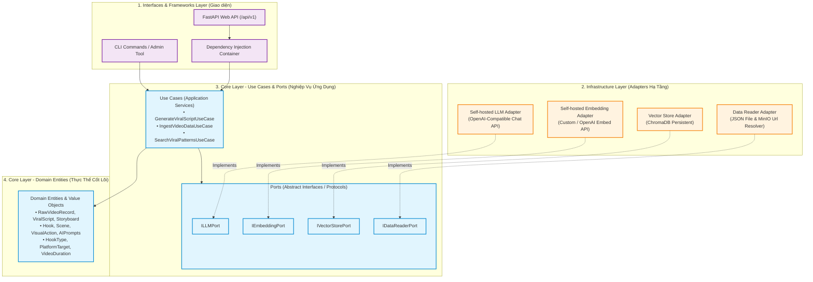
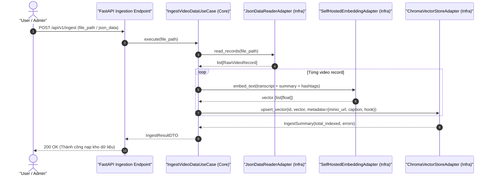
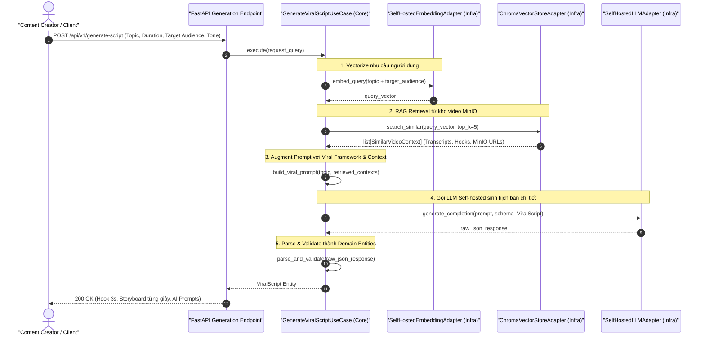
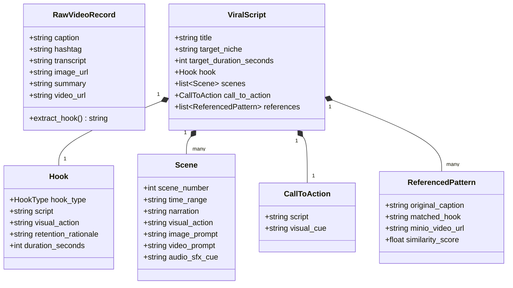

# System Architecture & Technical Specifications (Clean Architecture)

Tài liệu này đặc tả kiến trúc kỹ thuật của hệ thống **RAG Viral Video** tuân thủ triệt để nguyên lý **Clean Architecture (Hexagonal / Ports & Adapters)**.

Quy tắc cốt lõi: **Core Code và Infra Code hoàn toàn độc lập và tách biệt.**

---

## 1. Nguyên Tắc Thiết Kế Clean Architecture (The Dependency Rule)

Tất cả các thành phần trong hệ thống tuân thủ nghiêm ngặt **Quy tắc Phụ thuộc (Dependency Rule)**:
* Các tầng bên trong (Core) **tuyệt đối không phụ thuộc** và **không được phép import** bất kỳ thành phần nào của tầng bên ngoài (Infra, Frameworks, Web API).
* Mọi giao tiếp từ Core ra bên ngoài đều thông qua các **Giao diện trừu tượng (Ports / Protocols)**.
* Tầng Hạ tầng (Infra) đóng vai trò là các **Adapters** hiện thực hóa (implement) các Ports đó.
* Tầng Interfaces (FastAPI) đóng vai trò điều phối HTTP request, validate DTOs và tiêm phụ thuộc (Dependency Injection).



---

## 2. Phân Tách Chi Tiết: Core Code vs Infra Code

### 2.1. Tầng Lõi Nghiệp Vụ: Core Layer (`src/core/`)
* **Đặc tính:** Thuần túy Python chuẩn (Standard Library + Pydantic/Dataclasses). **Hoàn toàn không import bất kỳ thư viện hạ tầng thứ 3 nào (Không `fastapi`, không `chromadb`, không `httpx`).**
* **Bao gồm:**
  1. **Domain (`src/core/domain/`):**
     * `RawVideoRecord`: Thực thể đại diện cho 1 video trong kho dữ liệu.
     * `ViralScript`: Toàn bộ kịch bản hoàn chỉnh (Hook, Narration, Storyboard, CTA, References).
     * `Hook`: Phân loại hook (Shocking Fact, Contrarian, Problem-Agitate, Curiosity Gap), lời thoại mở đầu 3-5s, mô tả visual 3s đầu và phân tích tâm lý giữ chân (retention rationale).
     * `Storyboard` & `Scene`: Cấu trúc phân cảnh chi tiết theo giây (00:00 - 00:05), lời thoại, visual cues, prompt cho AI tạo ảnh (Midjourney/Flux) và prompt tạo video (Veo 3.1/Runway/Kling).
     * `Value Objects`: `HookType`, `PlatformTarget` (TikTok, Reels, Shorts), `VideoDuration`.
  2. **Ports (`src/core/ports/`):**
     * `ILLMPort`: Giao thức gửi system prompt, user prompt, và context sang mô hình ngôn ngữ lớn để nhận về kịch bản có cấu trúc.
     * `IEmbeddingPort`: Giao thức sinh vector float list từ văn bản (transcript, caption, tóm tắt).
     * `IVectorStorePort`: Giao thức lưu trữ và truy vấn vector tương đồng (k-Nearest Neighbors).
     * `IDataReaderPort`: Giao thức nạp và parse kho video JSON.
  3. **Use Cases (`src/core/use_cases/`):**
     * `GenerateViralScriptUseCase`: Nhận chủ đề & yêu cầu -> Vectorize query -> Truy xuất Top-K video viral tương đồng từ Vector Store -> Ghép bối cảnh vào Viral Master Prompt -> Gọi LLM -> Phân tích và sinh `ViralScript`.
     * `IngestVideoDataUseCase`: Đọc file kho JSON -> Làm sạch và chunking nội dung (Hook, Body, Summary) -> Gọi Embedding Port -> Đẩy vào Vector Store kèm metadata (MinIO URL, Hashtags, Hình ảnh).
     * `SearchViralPatternsUseCase`: Tra cứu nhanh các video tương đồng và các công thức hook đã thành công trong kho.

### 2.2. Tầng Hạ Tầng: Infrastructure Layer (`src/infra/`)
* **Đặc tính:** Hiện thực hóa các Ports thông qua các công nghệ và thư viện cụ thể.
* **Bao gồm:**
  * `infra/llm/`: `SelfHostedLLMAdapter` — Kết nối API LLM self-hosted qua chuẩn OpenAI Chat Completions (`/v1/chat/completions`), hỗ trợ format JSON Mode, xử lý retry và timeout.
  * `infra/embeddings/`: `SelfHostedEmbeddingAdapter` — Kết nối API mô hình Embedding riêng của bạn (chuẩn `/v1/embeddings` hoặc custom POST endpoint).
  * `infra/vector_store/`: `ChromaVectorStoreAdapter` — Triển khai lưu trữ vector với ChromaDB chế độ persistent on-disk, quản lý collections, indexing cosine similarity.
  * `infra/data_readers/`: `JsonDataReaderAdapter` — Đọc file JSON từ kho dữ liệu, linh hoạt ánh xạ các trường tiếng Việt (`caption`, `hastag`, `trancsript`, `hình ảnh`, `nội dung tóm tắt`, `url_video`).
  * `infra/config/`: `Settings` — Quản lý biến môi trường bằng `pydantic-settings` (URL, API keys, paths).

### 2.3. Tầng Giao Diện: Interfaces Layer (`src/interfaces/`)
* **Đặc tính:** Giao diện tiếp nhận tương tác từ bên ngoài.
* **Bao gồm:**
  * `interfaces/api/v1/routes/`: Router FastAPI tiếp nhận các HTTP requests.
  * `interfaces/schemas/`: Pydantic Request/Response DTOs cho API.
  * `interfaces/api/dependencies.py`: Container khởi tạo các Adapters và tiêm vào Use Cases (Inversion of Control).

---

## 3. Quy Trình Hoạt Động (Mermaid Sequence Diagrams)

### 3.1. Luồng Nạp Dữ Liệu Kho Video (Data Ingestion Flow)



### 3.2. Luồng Sinh Kịch Bản Viral (RAG Generation Flow)



---

## 4. Thiết Kế Chi Tiết Domain Entities & Cấu Trúc Kịch Bản



---

## 5. Cấu Trúc Thư Mục Dự Án (Folder Tree)

```
rag-viral-video/
├── docs/                                 # Tài liệu kỹ thuật & kiến trúc
│   ├── system-architecture.md            # Tài liệu này
│   ├── project-overview-prd.md           # Đặc tả yêu cầu sản phẩm
│   └── clean-architecture.md             # Quy tắc Clean Architecture
├── .agents/skills/                       # 61 kỹ năng hỗ trợ phát triển
├── src/
│   ├── core/                             # TẦNG CORE (Zero external infra dependencies)
│   │   ├── domain/
│   │   │   ├── entities/
│   │   │   │   ├── video_record.py       # RawVideoRecord
│   │   │   │   ├── viral_script.py       # ViralScript, Hook, Scene, CallToAction
│   │   │   │   └── reference_pattern.py  # ReferencedPattern
│   │   │   ├── value_objects/
│   │   │   │   ├── hook_type.py          # Enum: Problem-Agitate, Contrarian, Curiosity...
│   │   │   │   └── platform_target.py    # Enum: TikTok, Reels, Shorts
│   │   │   └── exceptions.py             # Domain exceptions
│   │   ├── ports/
│   │   │   ├── llm_port.py               # ILLMPort
│   │   │   ├── embedding_port.py         # IEmbeddingPort
│   │   │   ├── vector_store_port.py      # IVectorStorePort
│   │   │   └── data_reader_port.py       # IDataReaderPort
│   │   └── use_cases/
│   │       ├── generate_viral_script.py  # GenerateViralScriptUseCase
│   │       ├── ingest_video_data.py      # IngestVideoDataUseCase
│   │       └── search_viral_patterns.py  # SearchViralPatternsUseCase
│   │
│   ├── infra/                            # TẦNG INFRA (Triển khai các Ports)
│   │   ├── config/
│   │   │   └── settings.py               # Settings (Pydantic Settings & .env)
│   │   ├── llm/
│   │   │   └── self_hosted_llm.py        # SelfHostedLLMAdapter
│   │   ├── embeddings/
│   │   │   └── self_hosted_embed.py      # SelfHostedEmbeddingAdapter
│   │   ├── vector_store/
│   │   │   └── chroma_adapter.py         # ChromaVectorStoreAdapter
│   │   └── data_readers/
│   │       └── json_reader_adapter.py    # JsonDataReaderAdapter
│   │
│   └── interfaces/                       # TẦNG GIAO DIỆN (FastAPI)
│       └── api/
│           ├── v1/
│           │   ├── routes/
│           │   │   ├── generation.py     # POST /generate-script
│           │   │   ├── ingestion.py      # POST /ingest
│           │   │   ├── search.py         # POST /search-patterns
│           │   └── router.py             # Tổng hợp router v1
│           ├── schemas/                  # DTOs cho API
│           │   ├── request_dtos.py
│           │   └── response_dtos.py
│           └── dependencies.py           # DI Container
│
├── data/
│   ├── samples/                          # Sample JSON kho video
│   └── storage/                          # Local directory cho ChromaDB persistent
├── tests/
│   ├── unit/                             # Test Core với Mock Ports
│   └── integration/                      # Test Infra với ChromaDB & Adapters
├── .env.example
├── pyproject.toml
├── main.py                               # Entry point khởi chạy FastAPI
└── README.md
```
