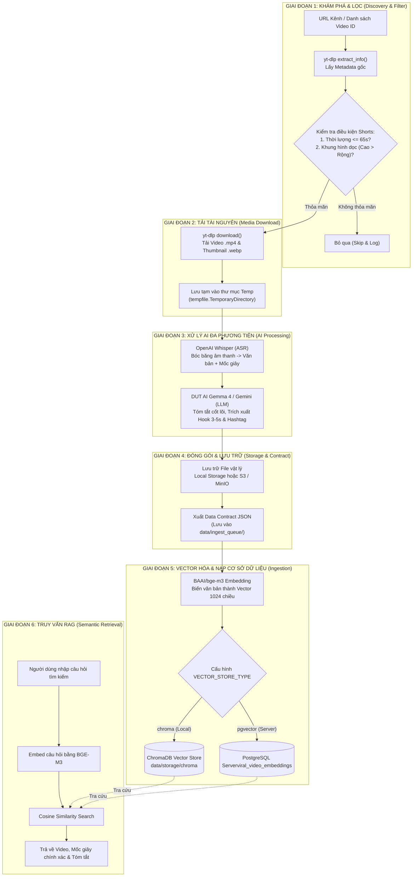
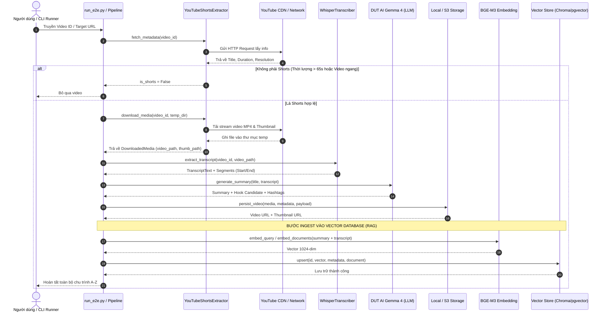

# BÁO CÁO TOÀN DIỆN WORKFLOW HỆ THỐNG: CRAWLER & VIDEO RAG PIPELINE
*Tài liệu kỹ thuật và vận hành mô tả chi tiết chu trình luân chuyển dữ liệu từ A đến Z*

---

## 1. TỔNG THỂ DÒNG CHẢY DỮ LIỆU (END-TO-END WORKFLOW)

Hệ thống được thiết kế theo mô hình **Dây chuyền sản xuất tự động khép kín (Autonomous Pipeline)**, chia làm 6 giai đoạn nối tiếp nhau:



---

## 2. SƠ ĐỒ TUẦN TỰ TƯƠNG TÁC GIỮA CÁC MODULE (SEQUENCE DIAGRAM)

Sơ đồ thể hiện chính xác các lệnh gọi hàm và thứ tự trao đổi giữa các thành phần mã nguồn trong dự án:



---

## 3. CHI TIẾT TỪNG GIAI ĐOẠN TRONG WORKFLOW

### Giai đoạn 1: Khám phá & Lọc sớm (Discovery & Early Filter)
* **File phụ trách**: [module/crawler/platforms/youtube_shorts/extractor.py](file:///Users/phat/video-rag/module/crawler/platforms/youtube_shorts/extractor.py)
* **Đầu vào (Input)**: Mã định danh video (`video_id`) hoặc URL kênh.
* **Hành động**:
  1. Sử dụng thư viện `yt-dlp` với tùy chọn `skip_download=True` để kéo metadata thô trong chưa đầy 1 giây.
  2. Áp dụng công thức kiểm duyệt:
     $$\text{is\_shorts} = (0 < \text{duration} \le 65) \land (\text{height} > \text{width} > 0)$$
* **Đầu ra (Output)**: Đối tượng `VideoMetadata`. Nếu không phải Shorts, dừng luồng ngay lập tức để tiết kiệm 100% băng thông và bộ nhớ.

---

### Giai đoạn 2: Tải Media tự động (Automated Media Download)
* **File phụ trách**: [module/crawler/platforms/youtube_shorts/extractor.py](file:///Users/phat/video-rag/module/crawler/platforms/youtube_shorts/extractor.py#L72-L114)
* **Đầu vào**: `video_id` và đường dẫn thư mục tạm thời `temp_dir`.
* **Hành động**:
  1. `yt-dlp` tự động dò tìm luồng phát chất lượng tốt nhất có định dạng `.mp4` (video + audio gộp).
  2. Tự động tải ảnh bìa đại diện của video (`thumbnail`).
  3. Quản lý trong `tempfile.TemporaryDirectory()`: File tạm sẽ tự động bị xóa sổ sau khi hoàn thành quy trình, bảo vệ máy chủ không bị tràn đĩa cứng.
* **Đầu ra**: `DownloadedMedia` gồm đường dẫn file video cục bộ và ảnh bìa.

---

### Giai đoạn 3: Bóc băng & Phân tích AI (ASR & LLM Summarization)
* **File phụ trách**: 
  * Bóc băng: [module/crawler/shared/transcriber.py](file:///Users/phat/video-rag/module/crawler/shared/transcriber.py)
  * Tóm tắt & Hook: [module/crawler/shared/llm_summary.py](file:///Users/phat/video-rag/module/crawler/shared/llm_summary.py)
* **Hành động**:
  1. **OpenAI Whisper**: Tách âm thanh từ file `.mp4`, nhận dạng tiếng Việt và ghi lại từng câu nói đi kèm mốc giây bắt đầu - kết thúc chính xác (`start`, `end`, `text`).
  2. **DUT AI Gemma 4 (hoặc Gemini)**: Đóng vai trò biên tập viên, đọc toàn văn lời thoại và tiêu đề để:
     * Viết bản tóm tắt súc tích từ 2 - 3 câu.
     * Trích xuất câu Hook mở đầu (3 đến 5 giây đầu tiên).
     * Chuẩn hóa danh sách hashtag phân loại.
* **Đầu ra**: `transcript`, `summary`, `hook`, `hashtags`.

---

### Giai đoạn 4: Đóng gói Data Contract & Lưu trữ (Storage)
* **File phụ trách**: [module/crawler/shared/storage.py](file:///Users/phat/video-rag/module/crawler/shared/storage.py)
* **Đầu vào**: Dữ liệu tổng hợp từ các bước trước.
* **Hành động**:
  1. Đẩy file video `.mp4` và ảnh `.webp` vào thư mục lưu trữ đích (`data/storage/` hoặc đẩy lên MinIO/S3).
  2. Đóng gói toàn bộ hồ sơ video thành 1 file JSON độc lập chuẩn Data Contract và đưa vào hàng đợi `data/ingest_queue/{video_id}.json`.
* **Cấu trúc dữ liệu chuẩn (Data Contract)**:
  ```json
  {
    "caption": "Tiêu đề và mô tả video...",
    "hashtag": ["tintuc", "vtv24", "phapluat"],
    "transcript": "Toàn văn lời thoại bóc băng...",
    "image_url": "path/to/thumbnail.webp",
    "summary": "Bản tóm tắt do AI viết...",
    "video_url": "path/to/video.mp4",
    "_enriched_metadata": {
      "video_id": "RiEg8h2jquM",
      "duration": 46.0,
      "metrics": { "view_count": 29817, "like_count": 166 },
      "transcript_segments": [...]
    }
  }
  ```

---

### Giai đoạn 5: Vector hóa & Nạp vào Cơ sở dữ liệu (Ingestion & Vector DB)
* **File phụ trách**: 
  * Use Case Ingest: [module/video_rag/use_case/ingest_video_data.py](file:///Users/phat/video-rag/module/video_rag/use_case/ingest_video_data.py)
  * Vector Store Adapter: [chroma_adapter.py](file:///Users/phat/video-rag/module/video_rag/infra/vector_store/chroma_adapter.py) & [pgvector_adapter.py](file:///Users/phat/video-rag/module/video_rag/infra/vector_store/pgvector_adapter.py)
* **Hành động**:
  1. Ghép nối văn bản cần tìm kiếm: `Title + Summary + Transcript + Hashtags`.
  2. Gọi mô hình **BAAI/bge-m3** (của DUT AI) để chuyển văn bản thành vector toán học **1024 chiều**.
  3. Ghi dữ liệu vào Vector Database tương ứng:
     * **Môi trường Local**: Ghi vào ChromaDB tại `data/storage/chroma/`.
     * **Môi trường Server**: Ghi vào bảng `viral_video_embeddings` trong PostgreSQL bằng câu lệnh `UPSERT` kèm cột `metadata JSONB`.

---

### Giai đoạn 6: Tìm kiếm ngữ nghĩa & Truy xuất RAG (Semantic Search)
* **File phụ trách**: [module/video_rag/use_case/search_viral_patterns.py](file:///Users/phat/video-rag/module/video_rag/use_case/search_viral_patterns.py)
* **Cách thức vận hành**:
  1. Người dùng gõ một truy vấn bất kỳ (ví dụ: *"ngao chết ô nhiễm môi trường"*).
  2. Hệ thống gọi BGE-M3 để mã hóa câu hỏi thành vector 1024 chiều.
  3. Thực hiện phép đo khoảng cách góc Cosine (Cosine Distance) giữa vector câu hỏi và hàng nghìn vector video trong Database.
  4. Trả về ngay lập tức: **Video có điểm số cao nhất**, hiển thị kèm **Tóm tắt, Hook, Lời thoại và vị trí giây phát tương ứng**.

---

## 4. BẢNG TỔNG KẾT TRẠNG THÁI THỰC THI

| Hạng mục | Công nghệ sử dụng | Môi trường Local (Hiện tại) | Môi trường Production Server (Sắp tới) |
| :--- | :--- | :--- | :--- |
| **Cào & Tải Media** | `yt-dlp` (Python API) | Tự động tải về máy cá nhân | Tự động tải trên máy chủ worker |
| **Bóc băng ASR** | OpenAI Whisper | Whisper `base` (chạy offline) | Whisper `large-v3` (chính xác 99%) |
| **Tóm tắt LLM** | DUT AI Gemma 4 | API `https://llm2.dutai.site/v1` | API DUT AI Gemma 4 |
| **Embedding** | BAAI/bge-m3 | API `https://textembedding.dutai.io.vn/v1` | API BGE-M3 1024-dim |
| **Lưu trữ File** | Local Disk / S3 | Thư mục `data/storage/` | MinIO / AWS S3 |
| **Vector Database** | Vector Store | ChromaDB (`data/storage/chroma`) | PostgreSQL `pgvector` (`viral_video_embeddings`) |
| **Xem dữ liệu** | CSV & Markdown Table | `data/database_export.csv` | DBeaver, pgAdmin hoặc REST API |
